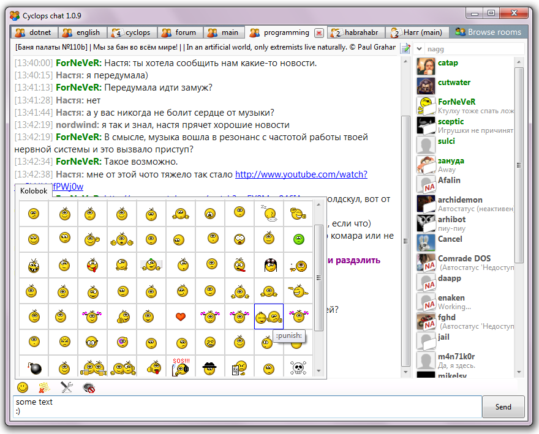
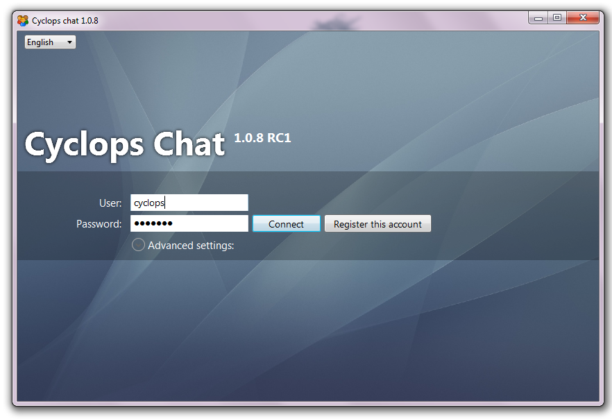

CyclopsChat (WPF XMPP client)
=============================

Cyclops chat is a simple XMPP muc client, it support the following features:
- MUC (user can close/create/join to conferences)
- Privates (double-click on user to start one)
- Animated smiles (JISP-compatible)
- Customizable UI
- Handles kicks, bans, nick conflicts, captchas, passwords, disconnects and etc.
- vCard-based avatars (supports caching)
- Tray, tabs and pop-ups notifications
- Nick and status changing (and displaying it on the user list)
- Localization (English and Russian)
- Bookmarks support

Download
--------

To download a binary distribution, please visit the [GitHub releases page][releases].

Screenshots
-----------





Build
-----

To build the project, install [.NET 6 SDK][dotnet-sdk], and then run the following in the shell:

```console
$ dotnet build
```

Documentation
-------------

- [Changelog][docs.changelog]
- [Maintainership][docs.maintainership]
- [License (MIT)][docs.license]
- [Third-party software ][docs.third-party]

# Acknowledgements

Originally, the project was developed by [@EgorBo][egorbo] and hosted on [CodePlex][codeplex].

[codeplex]: https://cyclopschat.codeplex.com/
[docs.changelog]: ./CHANGELOG.md
[docs.license]: ./LICENSE.md
[docs.maintainership]: ./MAINTAINERSHIP.md
[docs.third-party]: ./THIRD-PARTY-SOFTWARE.md
[dotnet-sdk]: https://dotnet.microsoft.com/download
[egorbo]: https://github.com/EgorBo
[releases]: https://github.com/ForNeVeR/CyclopsChat/releases
